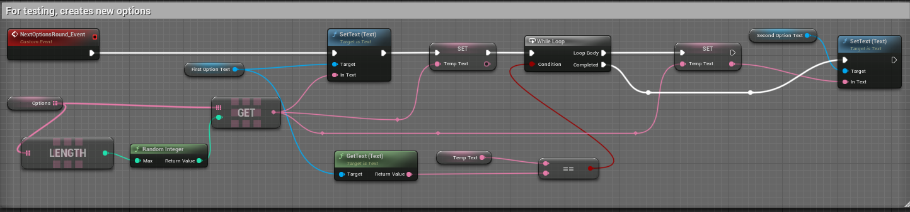
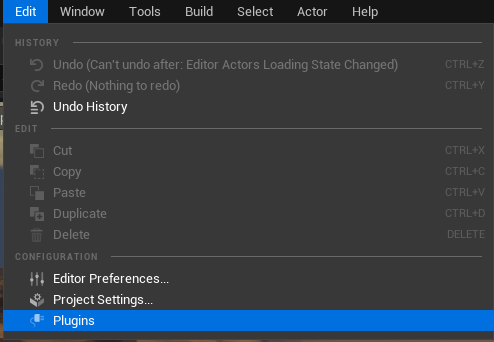

# ChatGPTUnrealPlugin
ChatGPTUnrealPlugin plugin for Unreal Engine.

## User guide

Welcome to the guide for the Chat GPT Subsystem. This plugin will allow you to have NPCs with more realistic dialogues thanks to the capabilities that Chat GPT has.

This guide is divided in two chapters, the first will cover the download and implementation of the plugin into an Unreal Engine project. The second will cover the use of the demo and its customization.

### Chapter 1: Download and implementation

First of all, you need to download the plugin. To do so, go to (link); once the download has finishes put the unziped files in the folder of your preference.

In case you don't have a project in which to implement the plugin, you need to create a new one in Unreal Engine 5.0.3.

Go to the root folder of the project in your file explorer an then to the plugins folder. In case you don’t have a plugins folder, create it.

Copy and paste the plugin files into the Plugins folder an accept all the changes.

Open your project on Unreal Engine, then go to Edit tab and click on Plugins.

In the new window search for the Chat GPT Subsystem plugin and make sure it is enabled.

Close the windows and then go to the content browser located in the bottom of the editor. Then click on settings and enable “Show Plugin Content” 

Doing it so will let you see the plugin content on the content browser. With this, the implementation has finished and you can have fun with the demo.

### Chapter 2: Use and customization
1. To start using the plugin you will need to put your API Key. To do this open the “WBP_ChatGPTBridgeDemo” blueprint and then go to the “Post Completions” node of the “Send Request_Event” event implementation. There you can write your key.
  
2. To test the plugin go to the “ChatGPTBridgeMapDemo” map. On this map you will be able to control a default character using normal third person controls. You will find an NPC, go in front of it to interact. 

3. Being in front of the NPC will activate the dialogue and disable all the inputs. You will see the dialogue box on the bottom part, which contains the NPC name and its first message. Also you will find 4 buttons of options.
  
4. Choosing one of the two middle buttons will send the text of the option as a prompt to Chat GPT API. Also, the option buttons will hide and the dialogue box will wait for an answer of the API
  
5. Once the subsystem gets a response it will show the first message of the next dialogue. Using the Enter key will let you move through the messages.
  
6. Finishing the current dialogue will appear the buttons again, but now with new options to choose.

7. Choosing “Custom” will appear an input text box for you to introduce your own prompt to answer. Clicking “send” button will start the process of wait for an answer.  
8. Finally, clicking the Exit option will close the dialogue and let you move again. 

With this you can playtest the demo. Now we will see how the logic works and how to customize for your own project.

9. First of all, in the NPC blueprint we have a BeginOverlap event to detect the player. This event calls the Open Dialogue Event of the character sending to it the NPC Name and the context for the AI. The parameters can be defined on the details panel of the NPC. In the case that you use another method to interact with the NPC make sure to call this event when you do so.

10. In the character blueprint we have the Open Dialogue Event that sends the parameters to the Widget of dialogues. Then disable the Player Controller inputs and make visible the Widget.
  

We also have a close dialogue event that does the exact opposite thing, enables the input and hide the widget.
  
11. In the blueprint of the widget we have the Construct event in wich we bind a event to the Post Completions Delegate of the subsystem.

  
  
12. The binded event validates the success and sends the result message divides by dots to the Start Dialogue Event.

13. In the same section we have the Send Request Event that sends the prompt to the API using the option request and the context. Here you can customize the way you send a prompt to the API and your API Key.

14. In the next section you will find the functionability of the dialogue system. 
  

* The Start Dialogue Event set the recieved messages in the local array of strings and set the NPC Name to the text box of the dialogue box. Then calls the next dialogue event.
* The Next Dialogue Event increment the current dialogue and sets the message to the text box. Once there is no more messages to show, it clears the messages array, show the buttons and calls for new options.
* The Enter Key Event calls for the Next Dialogue Event only if the length of the Messages Array is greater than 0. Here you can define the way you will move through the dialogues in your project.
* Finally, the Exit Dialogue event calls the Close Dialogue Event of the Character and restarts the general values of the Dialogue.

